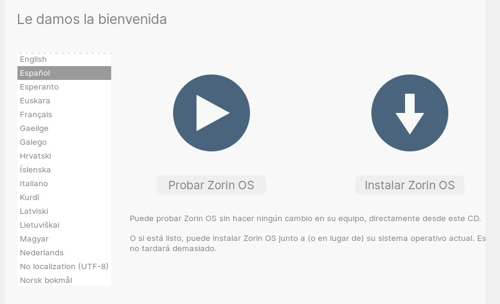
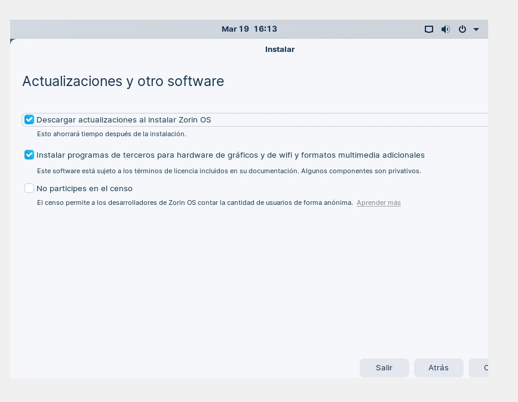

# ZorinSO

Zorin SO es una distribución GNU/Linux hecha en Irlanda, basada en Ubuntu y orientada principalmente a los nuevos usuarios en GNU/Linux, donde uno de los objetivos de esta distribución es intentar, desde un primer momento, brindarle al usuario una interfaz gráfica amigable y familiar.

## Requisitos de ZorinOS

Los requisitos para poder utilizar ZorinOS son:

* Procesador de 1 GHz dual core de 64 bits.
* 2 GB de memoria RAM.
* 10 GB de espacio en el disco duro para  la versión Core o Educational. (20 GB para la edición Ultimate).
* Pantalla de 800×600 px.

## Creacion de la maquina virtual en Virtual Box

se escoge un tamaño fijo 

Al iniciar el medio de instalación, el GRUB nos permitirá seleccionar entre las siguientes opciones de arranque:

* Try or install Zorin OS: Prueba o instala ZorinOS.
* Try or install Zorin OS (safe graphics): Prueba o instala ZorinOS (Gráficos seguros).
* Try or install Zorin OS (modern NVIDIA drivers): Prueba o instala ZorinOS (controladores modernos de NVIDIA).
* Check installation medium for defects: Compruebe si el medio de instalación presenta defectos.
* Power Off: Apagar.

Nosotros acudiremos a la primera opción, iniciará el Live de ZorinOS para probarlo y desde allí mismo lo instalaremos. 

primero se selecciona nombre y el sistema operativo, en este caso *ZORIN OS* y el sistema operativo *oracle de 64bits* 

La interfaz de instalación viene por defecto en Ingles, la primera opción nos permite modificar el idioma de esta interfaz. En mi caso, seleccionamos Español.

En este paso nos es posible elegir 3 opciones.

Seleccionando la opción de <b>actualizaciones al instalar ZorinOS</b>, hará que mientras se efectuá la instalación de la distribución se lleven a delante todas las actualizaciones de aquellos paquetes que que se instalaran, pero que se encuentran en versiones mas antiguas respecto a la de los repositorios.

Seleccionando la opción de <b>Instalar software de terceros</b> permite fundamentalmente instalar controladores privativos o de terceros en caso de que el Kernel no cuente con los módulos que nos permitan arrancar algunos de los componente de nuestro hardware.

Seleccionando la opcion en <b>No participes en el senso</b> en el caso de no seleccionar esta opción, simplemente se contara como una instalación en las estadísticas para el proyecto de forma anónima.

Al momento de crear las particiones para instalar ZorinOS, podemos tomar dos posibles caminos. Utilizar todo el disco para instalar nuestro sistema sin particiones, o particionar el disco para crear diferentes puntos de montaje (un poquito mas complejo).

Al momento de crear las particiones para instalar ZorinOS, podemos tomar dos posibles caminos. Utilizar todo el disco para instalar nuestro sistema sin particiones, o particionar el disco para crear diferentes puntos de montaje (un poquito mas complejo).

