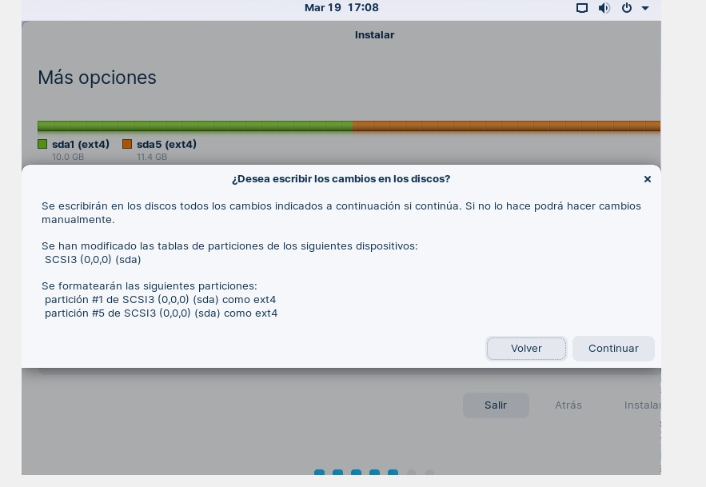
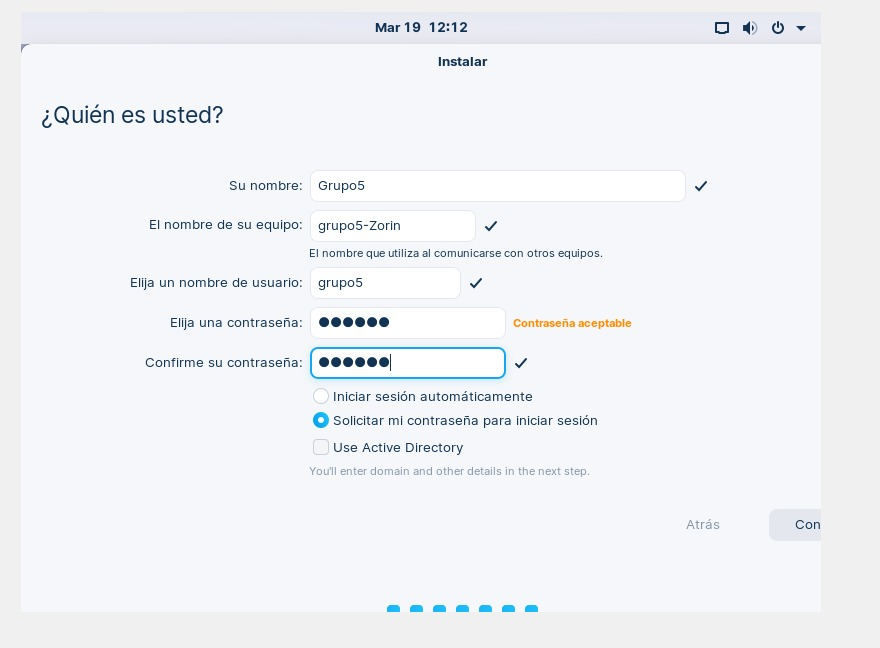
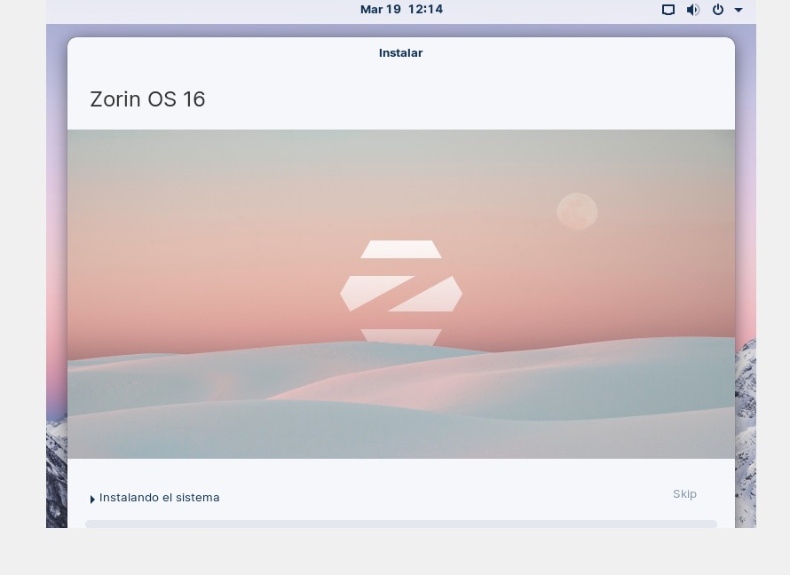
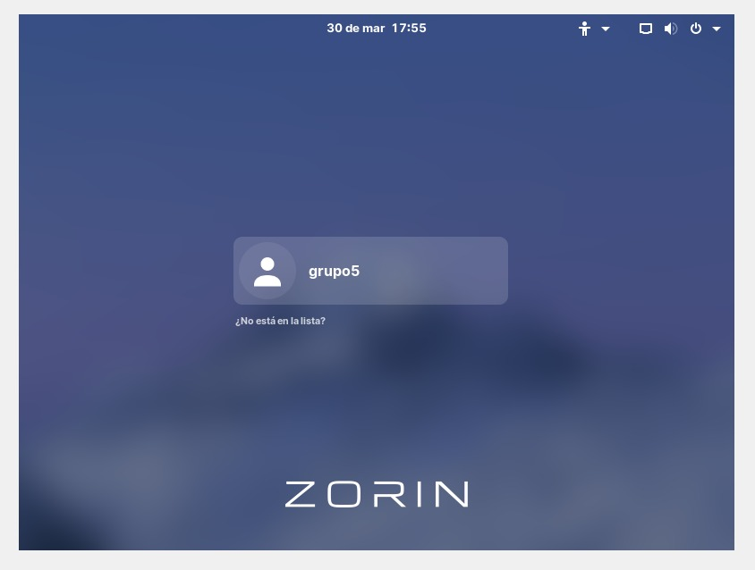

# ZorinSO

Zorin SO es una distribución GNU/Linux hecha en Irlanda, basada en Ubuntu y orientada principalmente a los nuevos usuarios en GNU/Linux, donde uno de los objetivos de esta distribución es intentar, desde un primer momento, brindarle al usuario una interfaz gráfica amigable y familiar.

## Requisitos de ZorinOS

Los requisitos para poder utilizar ZorinOS son:

* Procesador de 1 GHz dual core de 64 bits.
* 2 GB de memoria RAM.
* 10 GB de espacio en el disco duro para  la versión Core o Educational. (20 GB para la edición Ultimate).
* Pantalla de 800×600 px.

## Creacion de la maquina virtual en Virtual Box

se escoge un tamaño fijo 

Al iniciar el medio de instalación, el GRUB nos permitirá seleccionar entre las siguientes opciones de arranque:

* Try or install Zorin OS: Prueba o instala ZorinOS.
* Try or install Zorin OS (safe graphics): Prueba o instala ZorinOS (Gráficos seguros).
* Try or install Zorin OS (modern NVIDIA drivers): Prueba o instala ZorinOS (controladores modernos de NVIDIA).
* Check installation medium for defects: Compruebe si el medio de instalación presenta defectos.
* Power Off: Apagar.

Nosotros acudiremos a la primera opción, iniciará el Live de ZorinOS para probarlo y desde allí mismo lo instalaremos. 

primero se selecciona nombre y el sistema operativo, en este caso *ZORIN OS* y el sistema operativo *oracle de 64bits* 

La interfaz de instalación viene por defecto en Ingles, la primera opción nos permite modificar el idioma de esta interfaz. En mi caso, seleccionamos Español.

En este paso nos es posible elegir 3 opciones.

Seleccionando la opción de <b>actualizaciones al instalar ZorinOS</b>, hará que mientras se efectuá la instalación de la distribución se lleven a delante todas las actualizaciones de aquellos paquetes que que se instalaran, pero que se encuentran en versiones mas antiguas respecto a la de los repositorios.

Seleccionando la opción de <b>Instalar software de terceros</b> permite fundamentalmente instalar controladores privativos o de terceros en caso de que el Kernel no cuente con los módulos que nos permitan arrancar algunos de los componente de nuestro hardware.

Seleccionando la opcion en <b>No participes en el senso</b> en el caso de no seleccionar esta opción, simplemente se contara como una instalación en las estadísticas para el proyecto de forma anónima.

Al momento de crear las particiones para instalar ZorinOS, podemos tomar dos posibles caminos. Utilizar todo el disco para instalar nuestro sistema sin particiones, o particionar el disco para crear diferentes puntos de montaje.

## Con particiones
Los mas comunes por los cuales se crean particiones como puntos de montaje son:

* <b>/boot</b>: Arranque del sistema.
* <b>/</b>: Contiene toda la estructura de directorios del sistema operativo.
* <b>/</b> y <b>home</b>: Contiene los directorios de los usuarios.

En primer lugar, si la unidad de almacenamiento no tiene tabla de particiones, se nos solicitara crear una.

Por defecto creará una tabla de particiones MBR, cuya principar característica es que nos permite crear hasta 4 particiones primarias.

Para que tanto las particiones creadas como los puntos de montajes se apliquen, seleccionamos Instalar ahora y despues en continuar.

Antes de concluir con las opciones de instalación, tendremos que crear las credenciales de acceso y el nombre del equipo. El usuario que creemos será utilizado como usuario de sistema y el nombre del equipo es el hostname que corresponderá al al dispositivo y con el que sera visible en la red. Para esta guía, utilizaré las credenciales visibles en pantalla.

Usuario: Grupo5
Nombre de equipo: grupo5-Zorin

Ahora solo queda esperar a que el proceso de instalación del sistema, tal cual lo indicamos, concluya.

Una vez instalado, podremos elegir entre seguir probando ZorinOS en modo Live o reiniciar el sistema. En caso de reiniciar, recomendamos extraer el medio de instalación, porque si esta configurado por defecto como el primer medio de arranque, iniciara nuevamente en lugar del sistema.

Y listo asi concluimos con la Instalación de ZORIN SO

#

Zorin Group es <b>la empresa de tecnología</b> detrás del desarrollo de Zoris OS, un sistema operativo Linux utilizado por millones de usuarios en todo el mundo. El Grupo Zorin crea nuevas tecnologías para personas de todo el mundo, y el principal producto de la empresa es el popular sistema operativo Zorin OS. El Grupo Zorin desarrolla productos basados en Linux y, en general, es un especialista en sistemas operativos, Linux, desarrollo de software y diseño.
  
## 
VENTAJAS
 
•	Desde el momento en que tienes el pendrive con el sistema portátil sorprende mucho que pueda caber y funcionar dentro de algo tan limitado eso habla bien de los pocos recursos que consume.

•	Hablando de consumo de memoria y procesador, en el poco tiempo que llevo usándolo, ya no se siente el ventilador, el teclado esta frío y todos los programas abren con una velocidad prácticamente instantánea.

•	Pensé que iba a ser muy difícil adaptarme porque dicen que debes ser un usuario avanzado en el uso de sistemas, pues realmente no es nada del otro mundo, solo unos pocos comandos de vez en cuando.

•	El entorno es similar a Windows, pero es mas simple y sencillo, las opciones de configuración son las necesarias y no se siente que falte nada.

•	Es mágico, prácticamente enchufas cualquier dispositivo a un puerto USB y este funciona sin necesidad de instalar ningún driver, incluso con dispositivos muy antiguos como una tablet genius que poseo que tuve que dejarlo de usar por el tema de drivers.

•	Si eres programador, el sistema ya viene con todo lo básico e indispensable para empezar, como el lenguaje C, C++, Python, JavaScript, Html y con algunas librerías de uso común entre aplicaciones como GTK para interfaces gráficas o SDL para manejar gráficos y audio.

•	El sistema tiene las aplicaciones necesarias, aplicaciones de calidad como GIMP o libre office, Firefox, thunder bird, editor de textos Gedit, que se parece a notepad++.

•	Lo extremadamente personalizable que puede ser el sistema, el sistema operativo persé tiene buenas opciones de personalización, pero si eres un usuario experto de Linux, pudieras cambiar el entorno XFCE por KDE, gnome entre otros.

•	Olvídese de los virus, al ser un sistema operativo donde no está la masa poblacional, poco interés hay por parte de los crackers en crear virus para Linux.

•	Es seguro, que mas que la posibilidad de cifrar el disco al momento de la instalación, en algunos entornos te obliga a tener un usuario con password, y en algunos hasta no tienes acceso al usuario root, todo esto se puede solucionar, pero siempre la seguridad va por delante.

•	El software de la tienda es gratuito, solo el software propietario lo debes de buscar por fuera como es el caso de StarUML, que tuve que instalarlo por seguir el programa de misión TIC, pero ya el software de la tienda es bastante bueno y llena mis expectativas.

•	Se siente en general como un sistema bien integrado, los programas comparten muchas librerías comunes, algunos se esfuerzan por evitar gran cantidad de dependencias, otros trabajan sin interfaz o con lo mínimo posible y eso se siente en el rendimiento.

•	La terminal es excelente, te ahorra mucho tiempo, puedes hacer mas tareas con menos comandos, es muy versátil, todos los comandos tienen su ayuda, algunos tienen su ayuda en español, si de casualidad buscas una librería que no tienes o que te has equivocado al teclear, la terminal te hace sugerencias de comandos que quizás buscabas.

•	Olvídate de optimizar, depurar, cerrar servicios, cerrar aplicaciones que inician sin que lo pidas. Aunque hay programas con el objetivo de ganar rendimiento y limpiar el sistema, realmente no es necesario si le das a tu equipo un uso bien pensado y si eres ordenado.

•	Duerme tranquilo, habla tranquilo que al menos no hay programas en segundo plano espiándote, al menos que yo sepa, cuando sea mas experto diré si es verdad o no.
  

## 
ENTORNO DE ESCRITORIO

ZORIN utiliza el entorno de escritorio GNOME, es un entorno de escritorio e infraestructura de desarrollo para sistemas operativos GNU/Linux, Unix y derivados Unix como BSD o Solaris; compuesto enteramente de software libre.
El proyecto fue iniciado por los programadores mexicanos Miguel de Icaza y Federico Mena en agosto de 19974 y forma parte oficial del proyecto GNU. Nació como una alternativa a KDE bajo el nombre de GNU Network Object Model Environment (Entorno de Modelo de Objeto de Red GNU). GNOME se ha traducido a 193 idiomas,5 con una cobertura mayor al 80% para 38 idiomas.3
GNOME está disponible en las principales distribuciones GNU/Linux, incluyendo Fedora, Debian, Ubuntu, EndeavourOS, Manjaro Linux, Red Hat Enterprise Linux, SUSE Linux Enterprise, CentOS, Oracle Linux, Arch Linux, Gentoo,6 SteamOS, entre otras. También, se encuentra disponible en Solaris, un importante sistema operativo UNIX y en Sistemas operativos tipo Unix como FreeBSD.
Ventajas Entorno de escritorio

* Es fácil de usar.
* El objetivo de Gnome es lograr un escritorio simple y agradable.
* Los diálogos y los menús que se muestran al usuario suelen ser simples y fácilmente entendibles.
* Existen muchas aplicaciones GTK que pueden hacer uso de las características avanzadas de Gnome para interactuar.

El <b>explorador de archivos</b> que utiliza esta distribución es, Nautilus, eficaz, Este explorador de archivos lo podemos encontrar de forma predeterminada y por defecto en escritorio GNOME, lo que garantiza su compatibilidad con diferentes entornos de escritorios para Linux, convirtiéndose en uno de los más populares.

Con Nautilus obtenemos todas las herramientas necesarias para poder disponer de una buena gestión, organización y manipulación de archivos. Cuenta con un diseño simple y una interfaz intuitiva compatible con complementos adicionales con los que aumentan sus características. En su contra, cabe destacar que es un programa bastante pesado y apenas dispone de opciones de personalización

*Creado por Juan Felipe Merchancano*
con colaboracion de:

- *Duvan Dario Aguirre*

- *Leonela Ateorthua*

