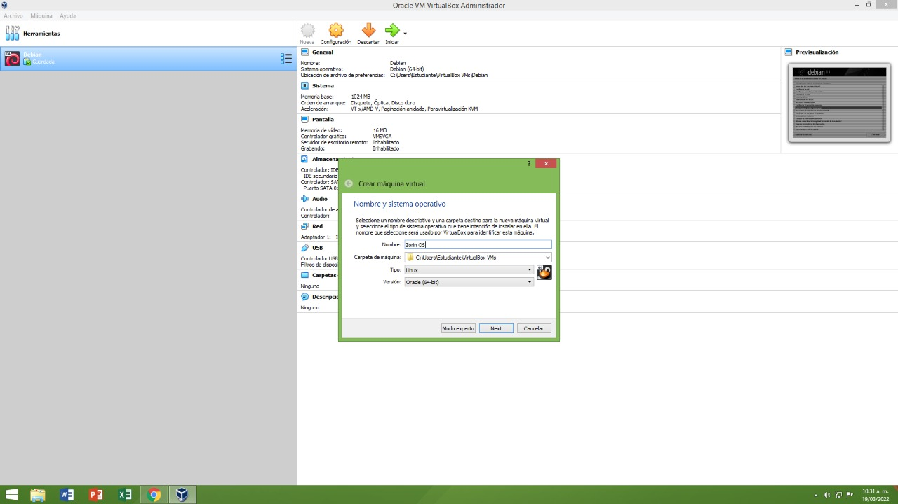
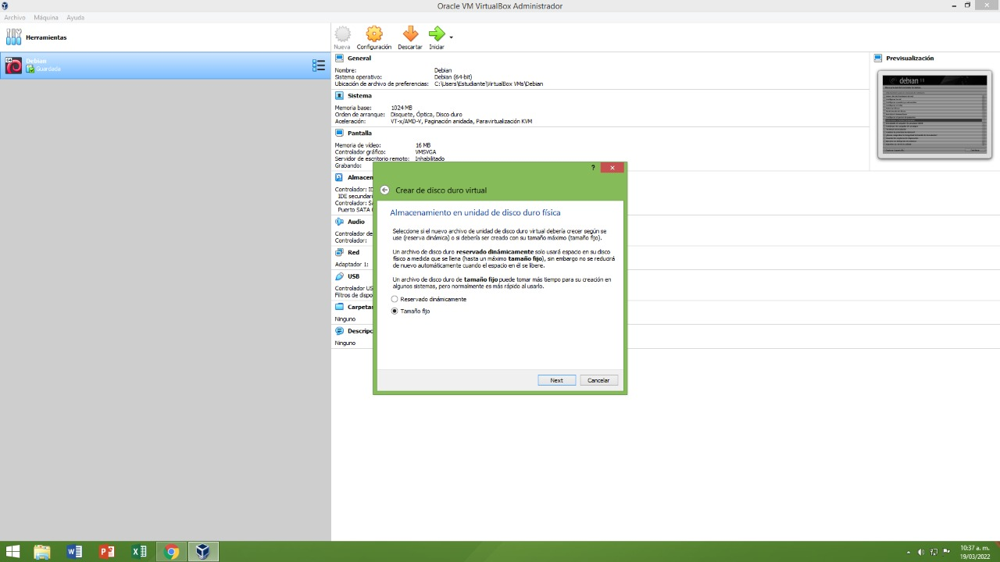
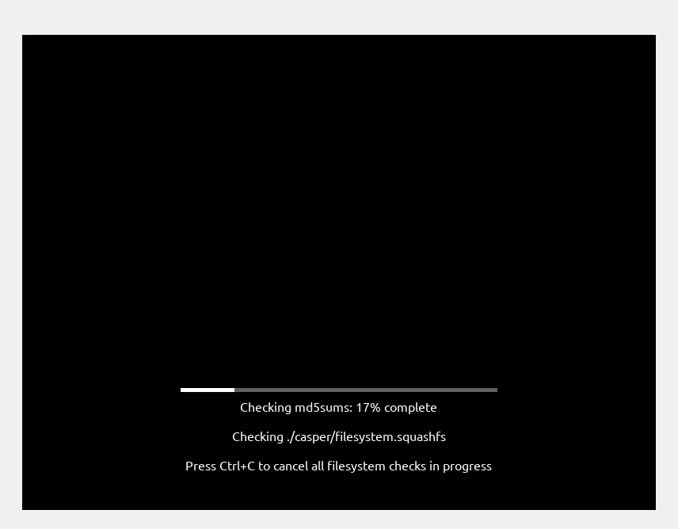

# ZorinSO
Instalación de Zorin
Creado por Juan Felipe Merchancano

## Creacion de la maquina virtual en Virtual Box

primero se selecciona nombre y el sistema operativo, en este caso *ZORIN OS* y el sistema operativo *oracle de 64bits* 

se escoge un tamaño fijo 

